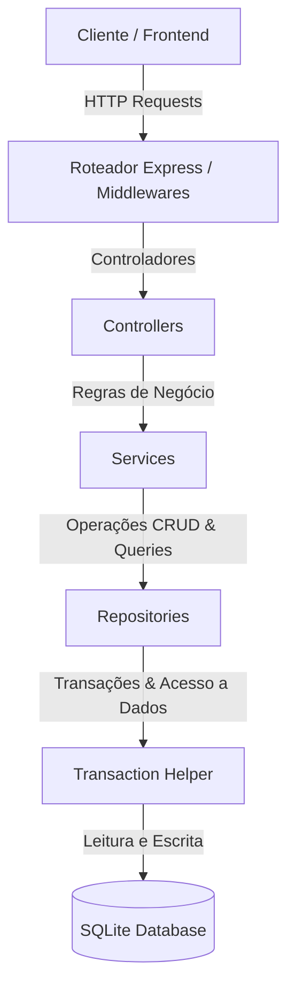

# 💈 AlphaCuts - Barbershop Management System

O **AlphaCuts** é uma solução completa de gestão para barbearias e salões de beleza, integrando uma API REST robusta a um front-end intuitivo para otimizar o fluxo de agendamentos e fidelização de clientes.

---

## 🛠️ Tecnologias e Ferramentas

### Frontend


### Backend & Database


### Testes & Qualidade


---

## 🏛️ Arquitetura do Sistema

O sistema é estruturado seguindo o padrão de **Camadas**, garantindo uma separação clara de responsabilidades, alta testabilidade e facilidade de manutenção.



### Camadas de Código (`src`)
*   **`routes/`**: Define os endpoints da API e mapeia as requisições HTTP para os controladores adequados.
*   **`middlewares/`**: Executa lógica intermediária de segurança, validações gerais e autenticação de tokens JWT.
*   **`controllers/`**: Recebe os parâmetros de entrada, formata as requisições e retorna as respostas HTTP.
*   **`services/`**: Centraliza toda a lógica de negócio do sistema (ex: regras de desconto, verificação de concorrência de horários/vagas).
*   **`repositories/`**: Abstrai as operações de persistência e comunicação direta com o banco de dados.
*   **`database/`**: Estabelece a conexão e cria as tabelas do banco SQLite.

---

## 🚀 Funcionalidades Principais

*   **💳 Clube de Vantagens:** Sistema de benefícios e cupons para clientes fiéis.
*   **📅 Atendimento Personalizado:** Agendamento rápido de serviços com o barbeiro preferido.
*   **👔 Gestão para o Profissional:** Gerenciamento completo de agenda e carteira de clientes para barbeiros e administradores.
*   **⚡ Segurança:** Validação de força de senha, envio de token para verificação de e-mail e controle de requisições por Rate Limiter.

---

## ⚙️ Como Instalar e Rodar

### Pré-requisitos
*   Node.js 18+ (recomendado: 20+)
*   NPM 9+

### 1) Clone o repositório
```bash
git clone https://github.com/williamalmeidadev/barbershop-management-api.git
cd barbershop-management-api
```

### 2) Instale as dependências
```bash
npm install
```

### 3) Configure o `.env`
Crie um arquivo `.env` na raiz do projeto:
```env
PORT=3000
JWT_SECRET=troque_por_uma_chave_forte

# Admin inicial (criado automaticamente ao iniciar a API, se não existir)
ADMIN_USUARIO=admin
ADMIN_NOME=Administrador
ADMIN_EMAIL=admin@alphacuts.com
ADMIN_PASSWORD=Admin@123
```

### 4) Rode a aplicação
Modo desenvolvimento:
```bash
npm run dev
```

Build + execução em produção:
```bash
npm run build
npm start
```

### 5) Popular o banco com dados de exemplo (Opcional)
```bash
npx ts-node src/seed.ts
```

Acesse a aplicação localmente nos links:
*   **App Cliente:** `http://localhost:3000/`
*   **Painel Administrativo:** `http://localhost:3000/admin-login`

---

## 👥 Equipe de Desenvolvedores

Projeto realizado com a colaboração de:
*   Caio José dos Santos Santana
*   Davi Balsamão
*   Esdras Estevão
*   João Matheus Pereira Andrade
*   José William Almeida
*   Otávio Augusto Grotto

---

## 📄 Licença
Distribuído sob a licença **MIT**.
